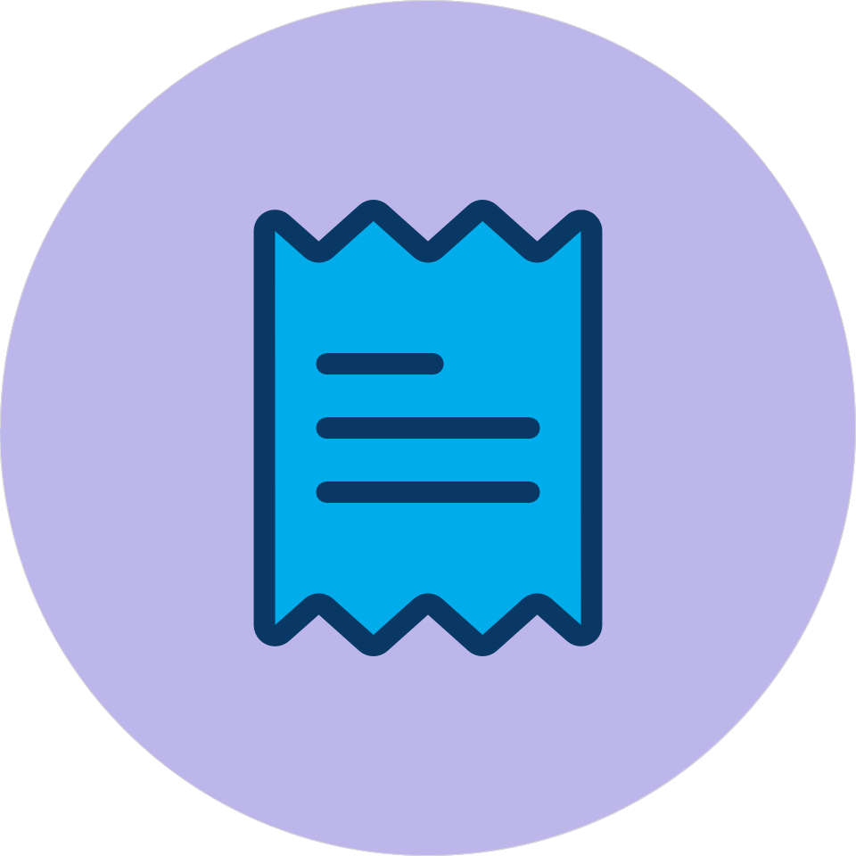

 
Website:
<a href="https://dotta.vrixe.com">dotta.vrixe.com</a>
 
<b>A subscription management and tracking NodeApp</b>

## About Dotta

Dotta is a `NodeJS` based app that give you a visual presentation and log of all your recurring subcriptions or payments.

- Dotta is a [Vrixe](https://github.com/chrisenitan/vrixe) sub tool

## Product image

## What it does in details

- Create, edit subscriptions
- List subscriptions created
- Coolate information and statistics amount subscriptions (individual and cummulative)
- Work in progress
  - Notify users of upcomiing of billed subscriptions
  - Other managements: disable, cancel and group subscriptions

# Stack

- UI
  - Template engine is handled with [Mustache](https://github.com/mustache/mustache.github.com)
  - Other custom styling done with native CSS
- Server Engine used is [Express](https://github.com/expressjs/express)
- Account and session management is custom built in dir: `/subModules`
- Database is MySql

### Project

- Project is managed on a [Trello Board](https://trello.com/b/TgYufO4D/dotta)
- Hosting and DNS is via Namecheap
- Databse is via AWS-RDS
- Cpanel handles both Node App engine and Git version control
  - Test version is on Heroku https://dotta.herokuapp.com/
- Git account is connected to the Git version control in the Cpanel account which pulls latest changes from `main` branch into a seperate hosting folder
- Deploy `.panel.yml` used in Node App Setup contains script to copy latest files from pulled repo folder into hosting root dir

**Cron Jobs**

- `ledger.php` handles logging all subscription according to their frequeicny and is ran once per day

### Setup

**This document assumes you have basic knowledge of `npm` and `javascript`** 

- Clone this repo
- Install dependencies via npm `npm install`
- Setup env file to connect to database
  - Env and database schema is limited to contributors
- Start the app with the script `npm start`

## Contributing

- Open: please ask for the schemas
- Please use this <a target="_blank" href="https://forms.gle/nNLY7e6ET1GQBwyN6">Google Form</a> for direct private feedbacks
